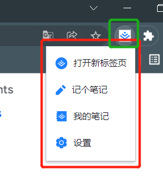
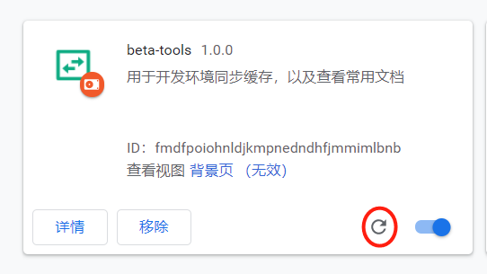

>  背景：
>
> 1. 日常开发中有一些鉴权页面，经常需要手动取同步一些缓存的参数才能在 http://localhost 上正常使用；这个过程比较繁琐
> 2. 在一些业务逻辑下，会出现不能关闭的强提醒；每次通过F12去关闭也挺麻烦

> 需求：
>
> 1. 通过浏览器插件，将测试的缓存同步到本地
> 2. 通过浏览器插件一键关闭本地强提醒弹窗

## 动手做

1. 了解 chrome 插件的几种形式

   1. popup形式：以图标形式出现在右侧工具栏，点击会出现弹窗

      

   2. theme形式：特殊的插件，会改变浏览器的主体色和背景图等

      

   > 这里选择 popup 形式

2. 插件的初始化 

   1. 目录结构如下

      ```jsvascript
      ├── manifest.json // 配置文件
      ├── popup.html    // 工具栏弹窗
      ├── popup.js      // 工具栏弹窗引用js
      ```

   2. manifest.json

      ```json
      {
        "name": "beta-tools",
        "version": "插件版本",
        "manifest_version": 2,
        "description": "插件用途描述",
        "icons": {
          "16": "img/logo.png",
          "48": "img/logo.png",
          "128": "img/logo.png"
        },
        "browser_action": {
          "default_title": "beta-tools",
          "default_icon": "img/logo.png",
          "default_popup": "popup.html"
        }
      }
      ```

      * icons：是在 chrome://extensions 页面展示的图标
      * browser_action：就是 popup 弹窗的相关配置
        * default_title: 在工具栏hover时，展示的内容
        * default_icon: 在工具栏展示的图标
        * default_popup: 对应本地 html 相对路径

   3. 打开 chrome://extensions

      1. 打开 "开发者模式"
      2. 选择左上角 "加载已解压的扩展程序"
      3. 选择 创建的文件夹
      4. 在当前页面就看到了 名称为 “beta-tools” 的插件已经加载出来了
      5. 地址栏右侧如果没出现 插件图标的话，点击 拼图图标把插件图标固定一下

      

      > 注意：之后每次更改代码，都需要点击刷新按钮

   4. 创建 popup 页面

      ```html
      <!DOCTYPE html>
      <html lang="zh-CN">
      <head>
          <meta charset="UTF-8">
          <title>beta-tools</title>
      </head>
      <body>
        <h1>hello world</h1>
        <script src="popup.js"></script>
      </body>
      </html>
      ```

   5. 创建popup.js

      ```javascript
      console.log(1);
      ```

   6. popup调试

      1. 右键点击：地址栏右侧的 插件图标 => 选择审查弹窗内容
      2. 点击 插件图标
         1. 弹出 弹窗显示：hello world
         2. 切回弹出的调试弹窗 看到控制台输出 1

   7. 完成上述步骤，一个基础的插件就好了

3. 下一步如何进行的思考

   * 问题：

     * 如何提取当前站点的 localStorage，并存储起来
     * 如何在其他标签页，将提取的缓存 再存进去

   * 解决：

     * 检索 [文档](https://developer.chrome.com/docs/extensions) 找到 content_script 是插入到页面中的脚本，可以 进行 提取当前页面相关数据

     * 提取出来的localStorage，借助插件本身的缓存来存储（上限5M绝对够用

       > content_script 以及插件本身的 storage 都需要在manifest中声明

4.  给插件增加 提取缓存、同步缓存、清空缓存的功能

   1. manifest 新增配置

      ```json
      "content_scripts": [
          {
              "matches": ["<all_urls>"],
              "js": ["content.js"]
          }
      ],
      "permissions": ["storage"]
      ```

      * matches：指定哪些网址需要加载 content.js（支持正则，这里我们直接设置为全部）
      * js：需要加载的到 页面的js脚本，可加载多个
      * permissions：指定插件拥有 的权限

   2. 新增 content.js

      ```javascript
      // 监听来自 popup/background的消息
      chrome.runtime.onMessage.addListener(
        function(request, sender, sendResponse) {
          if (request.type === "get"){
            sendResponse(localStorage);
          }
          if (request.type === "set") {
            // 获取并设置 缓存数据
            if (request.store) {
              Object.keys(request.store).forEach((key) => {
                localStorage[key] = request.store[key];
              })
              sendResponse();
            }
          }
        }
      );
      ```

   3. 完善 popup.js

      ```javascript
      const popupFunc = (function(){
        return {
          data: {
            ex: '',
            im: '',
            reset: '',
            header: '',
            context: '',
          },
          init(){
            this.data.ex = this.getDom('.export');
            this.data.im = this.getDom('.import');
            this.data.reset = this.getDom('.reset');
            this.data.header = this.getDom('.card-header');
            this.data.close = this.getDom('.close');
            chrome.storage.local.get(['text', 'store'], (res) => {
              this.setResult(res.store ? res.text : undefined);
            })
            this.addEvent();
          },
          getDom(name){
            return document.querySelector(name);
          },
          setResult(result = '暂无同步数据'){
            this.data.header.innerText = result;
          },
          addEvent(){
            let { ex, im, reset, close, checkbox } = this.data;
            ex.addEventListener('click', async () => {
              let currentTabId = await this.getCurrentTabId();
              chrome.tabs.sendMessage(currentTabId, { type: 'get' }, (data) => {
                if (data) {
                  let store = {};
                  Object.keys(data).forEach((item) => {
                    store[item] = data[item];
                  })
                  chrome.storage.local.set({store, text: 'storage已提取'}, () => {
                    this.setResult('storage已提取');
                  });
                }
              })
            })
            
            im.addEventListener('click', async () => {
              let currentTabId = await this.getCurrentTabId();
              chrome.storage.local.get(['store'], (res) => {
                chrome.tabs.sendMessage(currentTabId, { type: 'set', store: res.store }, (res) => {
                  this.setResult('storage已设置');
                })
              });
            })
            
            reset.addEventListener('click', () => {
              chrome.storage.local.set({store: null, text: ''}, () => {
                this.setResult();
              });
            })
          },
          getCurrentTabId(){
            return new Promise((resolve) => {
              chrome.tabs.query({
                active: true,
                currentWindow: true
              }, function(tabs) {
                resolve(tabs[0].id)
              })
            })
          }
        }
      })();
      popupFunc.init();
      ```

   4. 这里涉及到的主要知识点就是：popup.js 和 content.js 的通信问题

      ```javascript
      // popup.js
      // popup 发消息给 content，首先要获取当前 标签页的 id
      // 通过 chrome.tabs.query 获取 tab.id
      // 再通过 chrome.tabs.sendMessage 将消息发送出去
      chrome.tabs.query({
          active: true,
          currentWindow: true
      }, function(tabs) {
          chrome.tabs.sendMessage(tabs[0].id, { type: 'set', store: res.store }, (res) => {
              console.log({res});
          })
      })
      
      // content.js
      // 作为接收端，需要声明监听事件来监听 插件发送过来的消息
      chrome.runtime.onMessage.addListener(function(request, sender, sendResponse) {
          console.log({request, sender, sendResponse})
        }
      );
      ```

   5. 这样，就完成了基本的缓存提取、导入、清空功能

5. 下一步思考

   > 重写默认标签页，并增加配置项，可恢复为默认标签页

   * 问题：
     * 如何将 chrome的默认标签页，替换为自己想要的内容？
     * 要通过 什么 来控制 新建的标签页 是否展示为 自己重写的页面？
   * 解决：
     * 配置 chrome_url_overrides 重写 标签页
     * 在常驻后台进程 “backgroun.js” 中监听 chrome.tabs.onCreated.addListener 标签页创建事件，加业务判断是否重定向到 自己的标签页

   1. 新增 manifest.json 配置

      ```json
      "background": {
          "scripts": ["background.js"],
          "persistent": false
      },
      "chrome_url_overrides" : {
          "newtab": "tabPage.html"
      },
      "permissions": [
          "storage", "tabs"
      ]
      ```

      > tabs 权限： 用于在 chrome.tabs.query 回调中 获取 url 和 pendingUrl

   2. 新增 tabPage.html

      ```html
      <!DOCTYPE html>
      <html lang="en">
      <head>
        <meta charset="UTF-8">
        <title>自定义标签页</title>
      </head>
      <body>
          <h1>自定义标签页</h1>
      </body>
      </html>
      ```

   3. 新增 background.js

      ```javascript
      let isEnabled;
      chrome.storage.local.get(['enabled'], function(res){
        isEnabled = res.enabled;
      });
      
      chrome.storage.onChanged.addListener(function (changes){
        for (let [key, { oldValue, newValue }] of Object.entries(changes)) {
          if(key == "enabled"){
            isEnabled = newValue;
          }
        }
      });
      chrome.tabs.onCreated.addListener(function(){
        chrome.tabs.query({active: true, lastFocusedWindow: true}, (tabs) => {
          // 此处需要注意，要想拿到 url 和 pendingUrl 的值
          // 必须在 manifest -> permissions 中添加 tabs 权限
          // chrome-search://local-ntp/local-ntp.html 对应 chrome 浏览器默认标签页的地址
          let url = tabs[0].url;
          let pendingUrl = tabs[0].pendingUrl;
          if (url === '' && pendingUrl == "chrome://newtab/" && !isEnabled) {
            chrome.tabs.update(tabs[0].id, {url: 'chrome-search://local-ntp/local-ntp.html'});
          }
        });
      });
      ```

   4. 在 popup.html 增加跳转 新标签页

      ```html
      <div>
          <a href="chrome-extension://fmdfpoiohnldjkmpnedndhfjmmimlbnb/tabPage.html" target="_blank">常用文档</a>
          设为标签页 <input type="checkbox" class="checkbox">
      </div>
      ```

   5. 在 popup.js 新增设置 默认标签页 开关

      ```js
      addEvent(){
          checkbox.addEventListener('change', function(){
              chrome.storage.local.set({enabled: this.checked});
          })
      }
      ```

   6. 完成上述步骤，我们需要的功能就已经完成了

### 参考文档

https://developer.chrome.com/docs/extensions/mv2/content_scripts/


